# My Intent

An app that allows the user to start **any** android **intent** easily.

Documentation is available here: http://mareklangiewicz.pl/mi.html

* TODO: link to Google Play
* TODO: link to record screen video

#### Screenshots

###### Nexus 4 portrait

[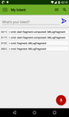](https://raw.githubusercontent.com/langara/MyIntent/myintent/screenshots/device-nexus4-port-2015-11-19-021911.png)

[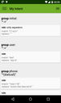](https://raw.githubusercontent.com/langara/MyIntent/myintent/screenshots/device-nexus4-port-2015-11-19-022042.png)
[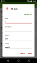](https://raw.githubusercontent.com/langara/MyIntent/myintent/screenshots/device-nexus4-port-2015-11-19-022205.png)
[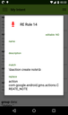](https://raw.githubusercontent.com/langara/MyIntent/myintent/screenshots/device-nexus4-port-2015-11-19-022253.png)
[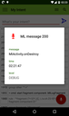](https://raw.githubusercontent.com/langara/MyIntent/myintent/screenshots/device-nexus4-port-2015-11-19-022327.png)

[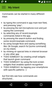](https://raw.githubusercontent.com/langara/MyIntent/myintent/screenshots/device-nexus4-port-2015-11-19-022509.png)

###### Nexus 7 portrait

[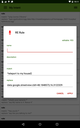](https://raw.githubusercontent.com/langara/MyIntent/myintent/screenshots/device-nexus7-port-2015-11-16-191142.png)
[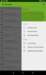](https://raw.githubusercontent.com/langara/MyIntent/myintent/screenshots/device-nexus7-port-2015-11-16-191213.png)

[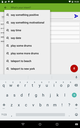](https://raw.githubusercontent.com/langara/MyIntent/myintent/screenshots/device-nexus7-port-2015-11-16-192039.png)

###### Nexus 7 landscape

[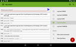](https://raw.githubusercontent.com/langara/MyIntent/myintent/screenshots/device-nexus7-land-2015-11-16-190317.png)
[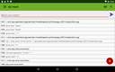](https://raw.githubusercontent.com/langara/MyIntent/myintent/screenshots/device-nexus7-land-2015-11-16-190351.png)
[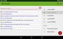](https://raw.githubusercontent.com/langara/MyIntent/myintent/screenshots/device-nexus7-land-2015-11-16-190528.png)
[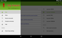](https://raw.githubusercontent.com/langara/MyIntent/myintent/screenshots/device-nexus7-land-2015-11-16-190558.png)

[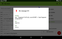](https://raw.githubusercontent.com/langara/MyIntent/myintent/screenshots/device-nexus7-land-2015-11-16-190752.png)
[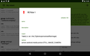](https://raw.githubusercontent.com/langara/MyIntent/myintent/screenshots/device-nexus7-land-2015-11-16-190953.png)

###### My Tab 10 Q portrait

[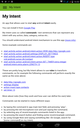](https://raw.githubusercontent.com/langara/MyIntent/myintent/screenshots/device-mytab-port-2015-11-16-165101.png)
[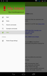](https://raw.githubusercontent.com/langara/MyIntent/myintent/screenshots/device-mytab-port-2015-11-16-165159.png)
[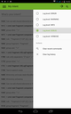](https://raw.githubusercontent.com/langara/MyIntent/myintent/screenshots/device-mytab-port-2015-11-16-165251.png)

###### My Tab 10 Q landscape

[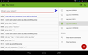](https://raw.githubusercontent.com/langara/MyIntent/myintent/screenshots/device-mytab-land-2015-11-16-164715.png)
[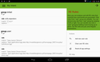](https://raw.githubusercontent.com/langara/MyIntent/myintent/screenshots/device-mytab-land-2015-11-16-164859.png)

[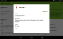](https://raw.githubusercontent.com/langara/MyIntent/myintent/screenshots/device-mytab-land-2015-11-16-165547.png)
[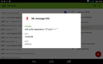](https://raw.githubusercontent.com/langara/MyIntent/myintent/screenshots/device-mytab-land-2015-11-16-165624.png)
[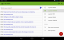](https://raw.githubusercontent.com/langara/MyIntent/myintent/screenshots/device-mytab-land-2015-11-16-165916.png)

